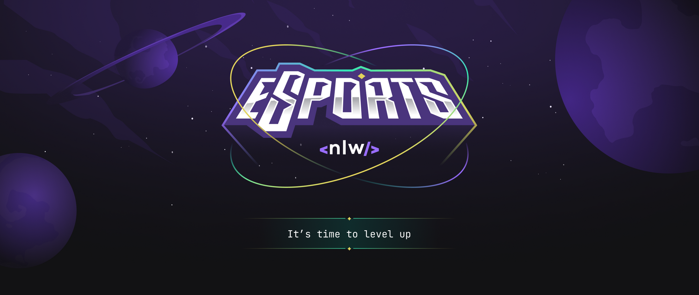

<h1 id="topo">Rocketseat- NLW - eSports</h1>

O QUE É O NEXT LEVEL WEEK?

**NLW** é o maior evento online e gratuito de programação na prática com muito código, desafios, networking e um único objetivo: te levar para o próximo nível
Durante uma semana você terá acesso a uma metodologia eficiente para o seu aprendizado, uma comunidade com milhares de devs e uma experiência completa pra acelerar sua evolução como dev. 💜

<h1>Aplicação NLW eSports - By RickHarDev</h1>

Trilha [Explorer](https://www.notion.so/Explorer-4c14a2c5b69f453e98d08ff44c865230)

Projeto construído do evento Next Level Week da Rocketseat.

[🔗 link da gitpage](https://rickhardbr.github.io/Rocketseat/nlw_eSports/)

## 🛠️ Tecnologias

* HTML

* CSS

* Git e Github

## 💛 Contato

## 📧 rickhhard@gmail.com
## 📧 rickhard@bol.com.br

<h4 align="right"><a href="#topo">Topo</a></h4>
